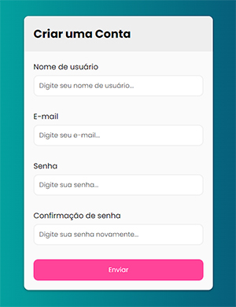
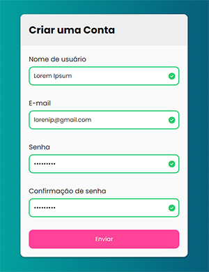
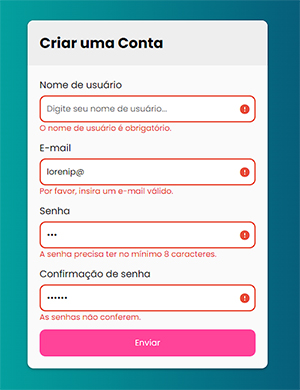

# Formulário com Validação

Estudo de um formulário com validação em cada campo preenchido pelo usuário, feito em HTML, CSS e JavaScript!

## Índice
- <a href="#Funcionalidades do Projeto">Funcionalidades do Projeto</a>
- <a href="#Layout">Layout</a>
- <a href="#Tecnologias Utilizadas">Tecnologias Utilizadas</a>
- <a href="#Contato">Contato</a>

## Funcionalidades do Projeto
- Validação do campo nome, no qual não pode ficar em branco.
- Validação do campo e-mail, apenas aceita estrutura de e-mail válida.
- Validação do campo senha, onde a senha precisa ter no mínimo 8 caracteres.
- Validação do campo confirmação de senha, verificando se a senha foi digitada corretamente em ambos os campos.

## Layout

## Tecnologias Utilizadas
- [x] HTML5
- [x] CSS3
- [x] JavaScript

## Contato
- [LinkedIn](https://www.linkedin.com/in/thiagotesilva/)
- [E-mail](mailto:thiagotesilva@hotmail.com)